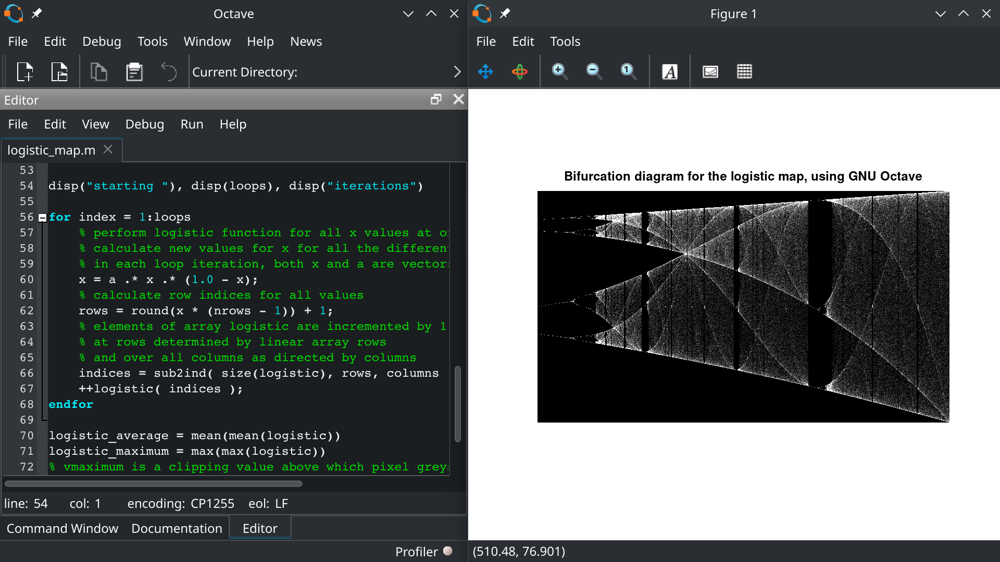
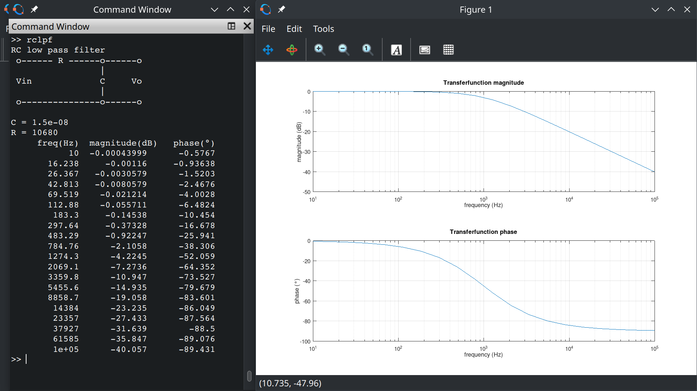
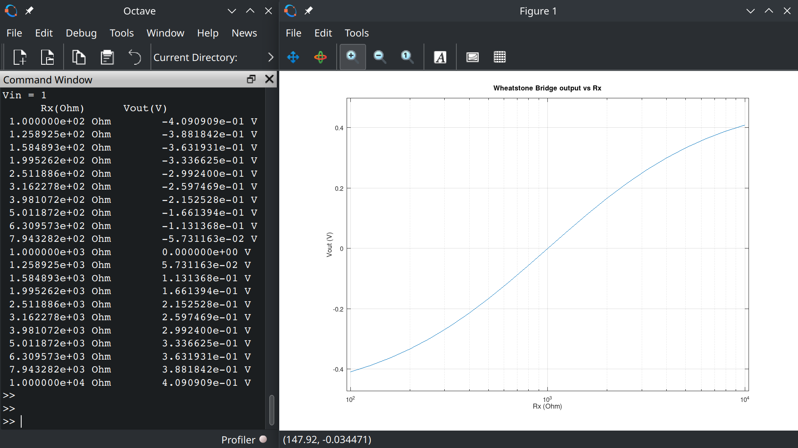
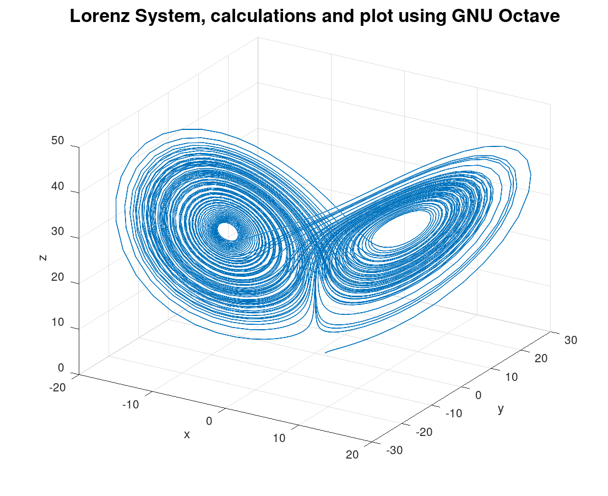

# GNU_Octave_scripts
Script files for use with GNU Octave

[https://octave.org](https://octave.org/)

## logistic_map.m

This GNU Ocave script calculates a image of the bifurcation diagram
for the logistic map 

Xn+1 = a. Xn.(1 - Xn)

Iterations are done for increasing values of 'a'
the logistic map is represented as a matrix
the map is displayed using the imshow(à function

## rclpf.m

Calculates the transferfunction of a simple RC low pass filter. 
Prints and plots results in dB magnitude and degrees phase.

## wbridge.m

Calculate output voltage of a Wheatstone Bridge as function of one
variable resisor Rx using Kirchhoff circuit laws and 
left division operator with a matrix and vector.
Plots semilog graph of Vout vs Rx and prints values.

## lorenz_system.m

This code calculates a solution for the Lorenz System with the system parameters sigma = 10, beta = 8.0 / 3.0, rho = 28.0.
It uses the Octave ode45() function to solve the system of ODEs. 
A plot is created showing the three variables x, y and z as 3D line plot.
